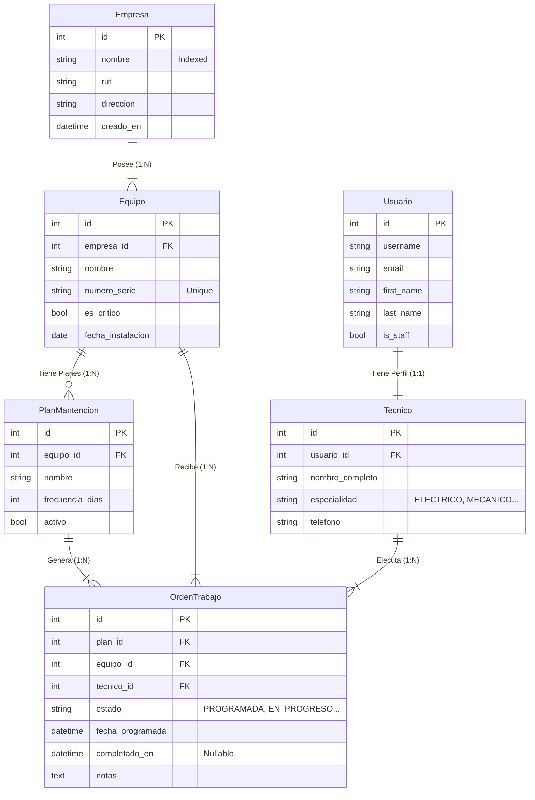

# Sistema de Gestión de Mantención Industrial (API RESTful)
   

## 📖 Introducción y Visión General

Bienvenido al repositorio del **Sistema de Gestión de Mantención Industrial**. Este proyecto representa la columna vertebral ("backend") de una plataforma diseñada para digitalizar y optimizar las operaciones de mantenimiento en el sector industrial de la región del Biobío.

El sistema resuelve la necesidad crítica de **trazabilidad y control**, permitiendo a las empresas gestionar sus activos, programar mantenimientos preventivos y monitorear la ejecución de órdenes de trabajo en tiempo real.

### 🧩 ¿Qué estamos presentando?
Más que un simple conjunto de archivos, presentamos una **API RESTful de Nivel Corporativo**. No es una página web tradicional (HTML/CSS), sino un motor lógico inteligente que:
1.  **Recibe peticiones** (Ej: "Crear una nueva orden de trabajo").
2.  **Procesa reglas de negocio** (Ej: "Verificar si el técnico está disponible").
3.  **Persiste datos** de forma segura en una base de datos relacional.
4.  **Responde** en formato JSON estándar para ser consumido por cualquier cliente (Web, Móvil, IoT).

---

## 💡 Decisión Técnica: Interfaz de Documentación (Swagger)

Como este es un proyecto Backend, no modificamos pixels, manipulamos datos. Para hacer tangible nuestro trabajo y permitir pruebas fluidas, hemos implementado **Swagger UI (vía OpenAPI 3.0)** como interfaz principal de interacción.

### ¿Qué es Swagger?
Es una suite de herramientas que convierte nuestro código en una página web interactiva. Lee automáticamente nuestros "contratos" de API (Endpoints, Modelos, Validaciones) y genera una interfaz donde cualquier persona puede probar el sistema pulsando botones, sin saber programar.

### ¿Por qué lo elegimos?
Elegimos la automatización con **Drf-Spectacular** en lugar de documentación manual por tres razones:
1.  **Verdad Única:** La documentación se genera desde el código. Si el código cambia, la documentación se actualiza sola. Nunca estará obsoleta.
2.  **Interactividad:** Permite ejecutar pruebas (POST, GET) directamente desde el navegador.
3.  **Estándar de Industria:** OpenAPI es el estándar mundial. Facilita la integración futura con equipos Frontend.

### ¿Qué alternativa hubiésemos usado?
Si no hubiéramos implementado Swagger, la alternativa tradicional habría sido entregar una **Colección de Postman** (un archivo JSON estático) o un documento PDF técnico.
*   **Desventaja de la alternativa:** Requiere que el usuario instale software extra (Postman) e importe archivos manualmente cada vez que hay un cambio, aumentando el riesgo de errores y desincronización.

---

## 🚀 Características Destacadas
*   **API RESTful Completa:** CRUD para Empresas, Equipos, Técnicos, Planes y Órdenes.
*   **Documentación Interactiva:** Swagger/OpenAPI autogenerado en español.
*   **Seguridad:** Autenticación JWT con rotación de tokens y permisos granulares.
*   **Optimización:** Consultas SQL optimizadas (`select_related`) y filtros avanzados.
*   **Arquitectura:** Estructura modular y escalable.

## 🏗️ Arquitectura y Modelado de Datos

El sistema utiliza una base de datos relacional robusta. A continuación se presenta el Diagrama Entidad-Relación (ER) del sistema:



## 💻 Tecnologías y Librerías
Este proyecto utiliza un stack moderno y eficiente:
*   **Django 5.0+**: Framework web de alto nivel.
*   **Django REST Framework**: Construcción de API.
*   **SimpleJWT**: Autenticación segura por tokens.
*   **Drf-Spectacular**: Generación de esquemas OpenAPI 3.0.
*   **Django-Filter**: Filtrado avanzado de querysets.

## 🛠️ Requisitos del Sistema
*   Python 3.10 o superior
*   Pip (Gestor de paquetes)
*   Git

## 🔧 Instalación y Puesta en Marcha

Sigue estos pasos para levantar el proyecto localmente:

### 1. Clonar el Repositorio
```bash
git clone "https://github.com/ColDev-Colivoro/backend-final.git"
cd backend_final
```

### 2. Crear y Activar Entorno Virtual
```bash
# Windows
python -m venv venv
.\venv\Scripts\Activate.ps1

# Linux/Mac
python3 -m venv venv
source venv/bin/activate
```

### 3. Instalar Dependencias
```bash
pip install -r requirements.txt
```

### 4. Configurar Base de Datos
```bash
python manage.py migrate
```

### 5. Crear Superusuario (Administrador)

**Opción A: Automático (Recomendado) ⭐**
```bash
python crear_superusuario.py
```
Este script crea automáticamente el usuario:
- **Usuario:** `admin`
- **Contraseña:** `admin123`
- **Email:** `admin@mantencion.local`

**Opción B: Manual**
```bash
python manage.py createsuperuser
# Ingresa los datos cuando te los pida:
# Username: admin
# Email: (presiona Enter)
# Password: admin123
# Password (again): admin123
```

**Nota:** Ambas opciones son válidas. La opción A es más rápida para desarrollo/evaluación.

### 6. Iniciar el Servidor
```bash
python manage.py runserver
```

El servidor estará disponible en: `http://localhost:8000/`

## 🖥️ Panel de Administración Visual (Django Admin)

Además de Swagger, el sistema incluye el **Panel de Administración** tradicional de Django, ideal para evaluadores que no están familiarizados con herramientas API.

**Acceso:** [http://localhost:8000/admin/](http://localhost:8000/admin/)
**Credenciales:** Usuario: `admin` / Contraseña: `admin123`

En este panel podrás crear, editar y eliminar registros con una interfaz gráfica familiar (similar a Excel o formularios web). Es la forma más intuitiva de probar el sistema sin conocimientos técnicos.

## 📚 Interfaces de Prueba del Sistema

El sistema ofrece **tres formas** de interactuar con la API. Cada una está diseñada para diferentes niveles técnicos:

---

### 1️⃣ API Navegable de Django REST Framework ⭐ **(RECOMENDADO)**

**¿Qué es?** Una interfaz HTML automática que convierte los endpoints en páginas web con formularios.

**¿Por qué es la mejor opción?**
- ✅ **Cero conocimientos técnicos necesarios**
- ✅ **Login con formulario visual** (como cualquier sitio web)
- ✅ **Navegación intuitiva** entre módulos
- ✅ **Formularios autocompletados** para crear datos

**¿Para quién?** Evaluadores, profesores y cualquier persona sin experiencia en APIs.

**Cómo usarla:**
1. **Página Principal:** [http://localhost:8000/api/](http://localhost:8000/api/)
   - Verás un menú organizado por categorías (🔐 Autenticación, 🏢 Empresas, etc.)
2. **Login:** Click en "Log in" (esquina superior derecha) → Usuario: `admin` | Contraseña: `admin123`
3. **Navega:** Haz click en cualquier enlace para ver/crear/editar datos

**URLs Directas:**

| Módulo | Endpoint | URL |
|--------|----------|-----|
| **🏠 Inicio** | Menú Principal | [/api/](http://localhost:8000/api/) |
| **🔐 Auth** | Login Visual | [/api-auth/login/](http://localhost:8000/api-auth/login/) |
| | Token JWT | [/api/auth/login/](http://localhost:8000/api/auth/login/) |
| **🏢 Empresas** | Lista/Crear | [/api/empresas/](http://localhost:8000/api/empresas/) |
| **⚙️ Equipos** | Lista/Crear | [/api/equipos/](http://localhost:8000/api/equipos/) |
| **👤 Usuarios** | Lista/Crear | [/api/usuarios/](http://localhost:8000/api/usuarios/) |
| **🔧 Técnicos** | Lista/Crear | [/api/tecnicos/](http://localhost:8000/api/tecnicos/) |
| **📅 Planes** | Lista/Crear | [/api/planes-mantencion/](http://localhost:8000/api/planes-mantencion/) |
| **📋 Órdenes** | Lista/Crear | [/api/ordenes-trabajo/](http://localhost:8000/api/ordenes-trabajo/) |

---

### 2️⃣ Swagger UI (OpenAPI 3.0) - Para Desarrolladores

**¿Qué es?** Documentación técnica interactiva generada automáticamente desde el código.

**¿Por qué usarlo?** Si necesitas ver todos los endpoints en un solo lugar, con documentación completa de schemas y validaciones.

**¿Para quién?** Desarrolladores y usuarios técnicos familiarizados con APIs REST.

**Acceso:** [http://localhost:8000/api/schema/swagger-ui/](http://localhost:8000/api/schema/swagger-ui/)

**Tutorial Detallado (Importante: sigue estos pasos en orden):**

**PASO 1: Obtener Token de Autenticación**
1. Busca el endpoint `POST /api/auth/login/` en la lista
2. Haz click en el endpoint para expandirlo
3. Click en el botón **"Try it out"** (esquina derecha)
4. Verás un **campo de texto editable** con un ejemplo de JSON
5. **Edita el JSON** y reemplaza los valores por:
   ```json
   {
     "username": "admin",
     "password": "admin123"
   }
   ```
6. Click en el botón azul **"Execute"**
7. En la sección "Responses" abajo, **copia el valor del campo `access`** (el token largo)

**PASO 2: Autorizar tus Peticiones**
1. Ve al **botón verde "Authorize"** (candado) en la parte superior de la página
2. Se abrirá una ventana con **dos opciones de autenticación**:
   - `cookieAuth (apiKey)` → **NO lo uses** (es para la API Navegable)
   - `jwtAuth (http, Bearer)` → **Usa este** ✅
3. En el campo de `jwtAuth`, escribe: `Bearer ` seguido del **token que copiaste en el PASO 1** (el valor de `access`)
   - Ejemplo: `Bearer eyJhbGciOiJIUzI1NI1NiJ9.eyJ0b2tlbl90eXBlIjoi...`
4. Click en **"Authorize"** y luego **"Close"**
5. ✅ Ahora verás candados cerrados 🔒 en todos los endpoints protegidos

**PASO 3: Usar los Endpoints Autenticados**
1. Ve a cualquier endpoint (por ejemplo `POST /api/empresas/`)
2. Click en **"Try it out"**
3. **Edita el JSON** con tus datos reales
4. Click en **"Execute"**
5. ¡Verás la respuesta del servidor abajo!

**Nota sobre `/api/auth/refresh/`:**
- ⚠️ Este endpoint NO es para login inicial
- Solo se usa para **renovar un token que está por expirar**
- Usa el `refresh` token (no el `access`) que obtuviste en el login
- Si estás empezando, ignora este endpoint

**Características Técnicas:**
- 📝 Documentación completa de schemas (tipos, validaciones, ejemplos)
- 🔐 Sistema de autorización JWT integrado
- ✨ Botón "Execute" para probar en vivo
- 📊 Visualización de modelos y respuestas
- 💾 Descarga de esquema OpenAPI en JSON/YAML

---

### 3️⃣ ReDoc (Solo Lectura)

**¿Qué es?** Vista estática de la documentación OpenAPI, sin interactividad.

**¿Para quién?** Para consultar la estructura de la API sin ejecutar peticiones.

**Acceso:** [http://localhost:8000/api/schema/redoc/](http://localhost:8000/api/schema/redoc/)

**Uso:** Ideal para imprimir o enviar como referencia técnica.

---

## 🎓 Guía de Prueba Completa (Recomendación de Uso)

**Para evaluadores no técnicos:** Usa la **API Navegable** ([/api/](http://localhost:8000/api/)). Es visual, intuitiva y no requiere conocimientos previos.

**Para desarrolladores:** Usa **Swagger UI** si necesitas ver todos los endpoints con documentación técnica completa.

### Flujo Recomendado para Probar el Sistema (API Navegable):
1. **Login:** [/api-auth/login/](http://localhost:8000/api-auth/login/) → `admin` / `admin123`
2. **Crear Empresa:** [/api/empresas/](http://localhost:8000/api/empresas/) → Usa el formulario HTML
3. **Crear Equipo:** [/api/equipos/](http://localhost:8000/api/equipos/) → Asigna a la empresa creada
4. **Crear Plan:** [/api/planes-mantencion/](http://localhost:8000/api/planes-mantencion/) → Asocia al equipo
5. **Verificar:** Navega de vuelta a `/api/` y explora las relaciones

## 🧪 Endpoints de la API

A continuación se listan todos los endpoints disponibles. Cabe destacar que cada recurso principal soporta operaciones completas (GET, POST, PUT, PATCH, DELETE).

| Recurso | Ruta API | Descripción |
| :--- | :--- | :--- |
| **Auth** | `/api/auth/login/` | Obtener Token JWT |
| **Empresas** | `/api/empresas/` | Gestión de Clientes |
| **Equipos** | `/api/equipos/` | Inventario de Máquinas |
| **Técnicos** | `/api/tecnicos/` | Perfiles de Staff |
| **Planes** | `/api/planes-mantencion/` | Definición de rutinas |
| **Órdenes** | `/api/ordenes-trabajo/` | Gestión de flujos de trabajo en terreno |

## 👥 Autores
*   **Jose Colivoro** - *Desarrollador Backend*

## 🔮 Puntos de Mejora y Futuro (Roadmap)

Aunque el sistema cumple con altos estándares de calidad, siempre hay espacio para crecer. Las siguientes son mejoras propuestas para una versión 2.0:

1.  **Dockerización:** Crear un `Dockerfile` y `docker-compose.yml` para desplegar el entorno completo (Django + DB + Redis) con un solo comando.
2.  **Notificaciones en Tiempo Real:** Implementar correos electrónicos automáticos a los técnicos cuando se les asigna una nueva Orden de Trabajo (actualmente sugerido en el código).
3.  **Caché con Redis:** Implementar caché para los endpoints de lectura frecuente (`/equipos/`, `/empresas/`) para reducir la carga en la base de datos.
4.  **CI/CD:** Configurar GitHub Actions para correr pruebas automáticas (linting y tests unitarios) en cada Push.
5.  **Dashboard de Métricas:** Crear un endpoint de reportería que entregue estadísticas como "Tiempo promedio de reparación" o "Técnico más productivo".

---
*Desarrollado para Inacap - Primavera 2025*
