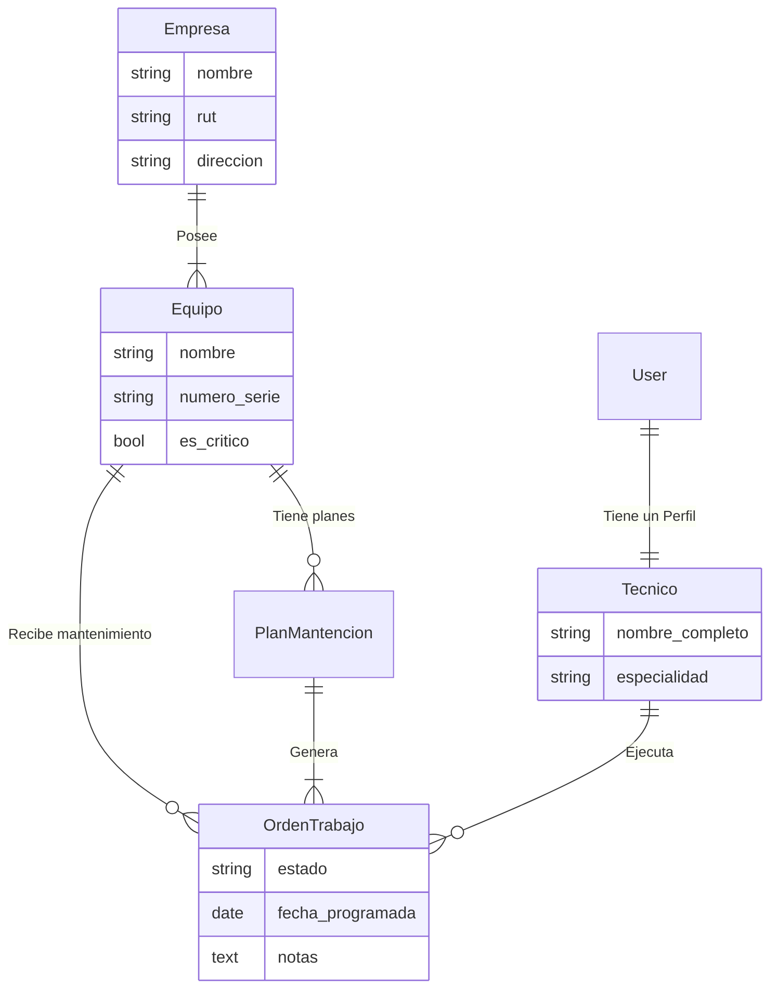

# Sistema de Gestión de Mantención Industrial (API RESTful)
   

Backend profesional para la gestión de empresas, equipos técnicos y órdenes de trabajo de mantenimiento. Desarrollado como parte de la Evaluación 4 (TI3041).

## 🚀 Características "Nivel 10"
*   **API RESTful Completa:** CRUD para Empresas, Equipos, Técnicos, Planes y Órdenes.
*   **Documentación Interactiva:** Swagger/OpenAPI autogenerado en español.
*   **Seguridad:** Autenticación JWT con rotación de tokens y permisos granulares.
*   **Optimización:** Consultas SQL optimizadas (`select_related`) y filtros avanzados.
*   **Arquitectura:** Estructura modular y escalable.

## 🏗️ Arquitectura y Modelado de Datos

El sistema utiliza una base de datos relacional robusta. A continuación se presenta el Diagrama Entidad-Relación (ER) del sistema:



## 💻 Tecnologías y Librerías
Este proyecto utiliza un stack moderno y eficiente:
*   **Django 5.0+**: Framework web de alto nivel.
*   **Django REST Framework**: Construcción de API.
*   **SimpleJWT**: Autenticación segura por tokens.
*   **Drf-Spectacular**: Generación de esquemas OpenAPI 3.0.
*   **Django-Filter**: Filtrado avanzado de querysets.

## 🛠️ Requisitos del Sistema
*   Python 3.10 o superior
*   Pip (Gestor de paquetes)
*   Git

## 🔧 Instalación y Puesta en Marcha

Sigue estos pasos para levantar el proyecto localmente:

### 1. Clonar el Repositorio
```bash
git clone "https://github.com/ColDev-Colivoro/backend-final.git"
cd backend_final
```

### 2. Crear y Activar Entorno Virtual
```bash
# Windows
python -m venv venv
.\venv\Scripts\Activate.ps1

# Linux/Mac
python3 -m venv venv
source venv/bin/activate
```

### 3. Instalar Dependencias
```bash
pip install -r requirements.txt
```

### 4. Configurar Base de Datos
```bash
python manage.py migrate
```

### 5. Crear Superusuario (Administrador)
```bash
python manage.py createsuperuser
# Sigue las instrucciones en pantalla
```

### 6. Iniciar el Servidor
```bash
python manage.py runserver
```

El servidor estará disponible en: `http://localhost:8000/`

## 📚 Documentación de la API

El proyecto cuenta con documentación viva. Una vez iniciado el servidor, visita:

*   **Swagger UI (Recomendado):** [http://localhost:8000/api/schema/swagger-ui/](http://localhost:8000/api/schema/swagger-ui/)
    *   Prueba los endpoints directamente desde el navegador.
*   **ReDoc:** [http://localhost:8000/api/schema/redoc/](http://localhost:8000/api/schema/redoc/)

## 🧪 Endpoints de la API

A continuación se listan todos los endpoints disponibles. Cabe destacar que cada recurso principal soporta operaciones completas (GET, POST, PUT, PATCH, DELETE).

| Recurso | Ruta API | Descripción |
| :--- | :--- | :--- |
| **Auth** | `/api/auth/login/` | Obtener Token JWT |
| **Empresas** | `/api/v1/empresas/` | Gestión de Clientes |
| **Equipos** | `/api/v1/equipos/` | Inventario de Máquinas |
| **Técnicos** | `/api/v1/tecnicos/` | Perfiles de Staff |
| **Planes** | `/api/v1/planes-mantencion/` | Definición de rutinas |
| **Órdenes** | `/api/v1/ordenes-trabajo/` | Gestión de flujos de trabajo en terreno |

## 👥 Autores
*   **Jose Colivoro** - *Desarrollador Backend*

## 🔮 Puntos de Mejora y Futuro (Roadmap)

Aunque el sistema cumple con el estándar "Nivel 10", siempre hay espacio para crecer. Las siguientes son mejoras propuestas para una versión 2.0:

1.  **Dockerización:** Crear un `Dockerfile` y `docker-compose.yml` para desplegar el entorno completo (Django + DB + Redis) con un solo comando.
2.  **Notificaciones en Tiempo Real:** Implementar correos electrónicos automáticos a los técnicos cuando se les asigna una nueva Orden de Trabajo (actualmente sugerido en el código).
3.  **Caché con Redis:** Implementar caché para los endpoints de lectura frecuente (`/equipos/`, `/empresas/`) para reducir la carga en la base de datos.
4.  **CI/CD:** Configurar GitHub Actions para correr pruebas automáticas (linting y tests unitarios) en cada Push.
5.  **Dashboard de Métricas:** Crear un endpoint de reportería que entregue estadísticas como "Tiempo promedio de reparación" o "Técnico más productivo".

---
*Desarrollado para Inacap - Primavera 2025*
