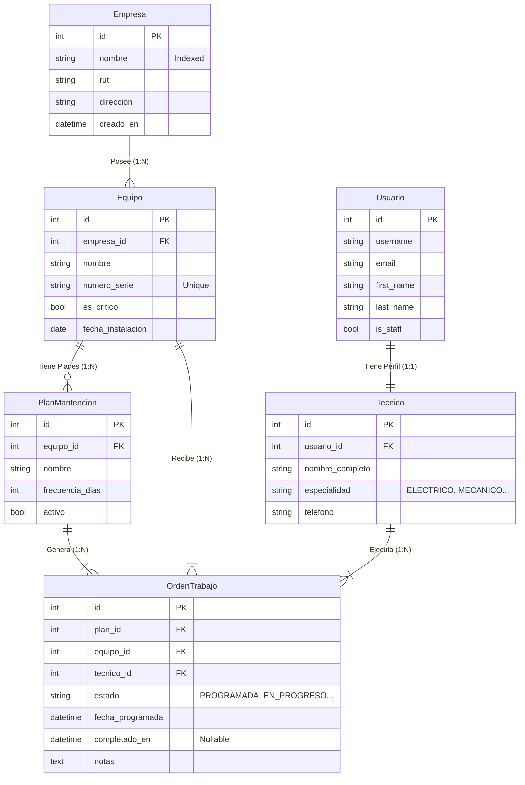

# Sistema de Gestión de Mantención Industrial (API RESTful)
   

## 📖 Introducción y Visión General

Bienvenido al repositorio del **Sistema de Gestión de Mantención Industrial**. Este proyecto representa la columna vertebral ("backend") de una plataforma diseñada para digitalizar y optimizar las operaciones de mantenimiento en el sector industrial de la región del Biobío.

El sistema resuelve la necesidad crítica de **trazabilidad y control**, permitiendo a las empresas gestionar sus activos, programar mantenimientos preventivos y monitorear la ejecución de órdenes de trabajo en tiempo real.

### 🧩 ¿Qué estamos presentando?
Más que un simple conjunto de archivos, presentamos una **API RESTful de Nivel Corporativo**. No es una página web tradicional (HTML/CSS), sino un motor lógico inteligente que:
1.  **Recibe peticiones** (Ej: "Crear una nueva orden de trabajo").
2.  **Procesa reglas de negocio** (Ej: "Verificar si el técnico está disponible").
3.  **Persiste datos** de forma segura en una base de datos relacional.
4.  **Responde** en formato JSON estándar para ser consumido por cualquier cliente (Web, Móvil, IoT).

---

## 💡 Decisión Técnica: Interfaz de Documentación (Swagger)

Como este es un proyecto Backend, no modificamos pixels, manipulamos datos. Para hacer tangible nuestro trabajo y permitir pruebas fluidas, hemos implementado **Swagger UI (vía OpenAPI 3.0)** como interfaz principal de interacción.

### ¿Qué es Swagger?
Es una suite de herramientas que convierte nuestro código en una página web interactiva. Lee automáticamente nuestros "contratos" de API (Endpoints, Modelos, Validaciones) y genera una interfaz donde cualquier persona puede probar el sistema pulsando botones, sin saber programar.

### ¿Por qué lo elegimos?
Elegimos la automatización con **Drf-Spectacular** en lugar de documentación manual por tres razones:
1.  **Verdad Única:** La documentación se genera desde el código. Si el código cambia, la documentación se actualiza sola. Nunca estará obsoleta.
2.  **Interactividad:** Permite ejecutar pruebas (POST, GET) directamente desde el navegador.
3.  **Estándar de Industria:** OpenAPI es el estándar mundial. Facilita la integración futura con equipos Frontend.

### ¿Qué alternativa hubiésemos usado?
Si no hubiéramos implementado Swagger, la alternativa tradicional habría sido entregar una **Colección de Postman** (un archivo JSON estático) o un documento PDF técnico.
*   **Desventaja de la alternativa:** Requiere que el usuario instale software extra (Postman) e importe archivos manualmente cada vez que hay un cambio, aumentando el riesgo de errores y desincronización.

---

## 🚀 Características Destacadas
*   **API RESTful Completa:** CRUD para Empresas, Equipos, Técnicos, Planes y Órdenes.
*   **Documentación Interactiva:** Swagger/OpenAPI autogenerado en español.
*   **Seguridad:** Autenticación JWT con rotación de tokens y permisos granulares.
*   **Optimización:** Consultas SQL optimizadas (`select_related`) y filtros avanzados.
*   **Arquitectura:** Estructura modular y escalable.

## 🏗️ Arquitectura y Modelado de Datos

El sistema utiliza una base de datos relacional robusta. A continuación se presenta el Diagrama Entidad-Relación (ER) del sistema:



## 💻 Tecnologías y Librerías
Este proyecto utiliza un stack moderno y eficiente:
*   **Django 5.0+**: Framework web de alto nivel.
*   **Django REST Framework**: Construcción de API.
*   **SimpleJWT**: Autenticación segura por tokens.
*   **Drf-Spectacular**: Generación de esquemas OpenAPI 3.0.
*   **Django-Filter**: Filtrado avanzado de querysets.

## 🛠️ Requisitos del Sistema
*   Python 3.10 o superior
*   Pip (Gestor de paquetes)
*   Git

## 🔧 Instalación y Puesta en Marcha

Sigue estos pasos para levantar el proyecto localmente:

### 1. Clonar el Repositorio
```bash
git clone "https://github.com/ColDev-Colivoro/backend-final.git"
cd backend_final
```

### 2. Crear y Activar Entorno Virtual
```bash
# Windows
python -m venv venv
.\venv\Scripts\Activate.ps1

# Linux/Mac
python3 -m venv venv
source venv/bin/activate
```

### 3. Instalar Dependencias
```bash
pip install -r requirements.txt
```

### 4. Configurar Base de Datos
```bash
python manage.py migrate
```

### 5. Crear Superusuario (Administrador)
```bash
python manage.py createsuperuser
# Sigue las instrucciones en pantalla
```

### 6. Iniciar el Servidor
```bash
python manage.py runserver
```

El servidor estará disponible en: `http://localhost:8000/`

## 📚 Documentación de la API

El proyecto cuenta con documentación viva. Una vez iniciado el servidor, visita:

*   **Swagger UI (Recomendado):** [http://localhost:8000/api/schema/swagger-ui/](http://localhost:8000/api/schema/swagger-ui/)
    *   Prueba los endpoints directamente desde el navegador.
*   **ReDoc:** [http://localhost:8000/api/schema/redoc/](http://localhost:8000/api/schema/redoc/)

## 🧪 Endpoints de la API

A continuación se listan todos los endpoints disponibles. Cabe destacar que cada recurso principal soporta operaciones completas (GET, POST, PUT, PATCH, DELETE).

| Recurso | Ruta API | Descripción |
| :--- | :--- | :--- |
| **Auth** | `/api/auth/login/` | Obtener Token JWT |
| **Empresas** | `/api/empresas/` | Gestión de Clientes |
| **Equipos** | `/api/equipos/` | Inventario de Máquinas |
| **Técnicos** | `/api/tecnicos/` | Perfiles de Staff |
| **Planes** | `/api/planes-mantencion/` | Definición de rutinas |
| **Órdenes** | `/api/ordenes-trabajo/` | Gestión de flujos de trabajo en terreno |

## 👥 Autores
*   **Jose Colivoro** - *Desarrollador Backend*

## 🔮 Puntos de Mejora y Futuro (Roadmap)

Aunque el sistema cumple con altos estándares de calidad, siempre hay espacio para crecer. Las siguientes son mejoras propuestas para una versión 2.0:

1.  **Dockerización:** Crear un `Dockerfile` y `docker-compose.yml` para desplegar el entorno completo (Django + DB + Redis) con un solo comando.
2.  **Notificaciones en Tiempo Real:** Implementar correos electrónicos automáticos a los técnicos cuando se les asigna una nueva Orden de Trabajo (actualmente sugerido en el código).
3.  **Caché con Redis:** Implementar caché para los endpoints de lectura frecuente (`/equipos/`, `/empresas/`) para reducir la carga en la base de datos.
4.  **CI/CD:** Configurar GitHub Actions para correr pruebas automáticas (linting y tests unitarios) en cada Push.
5.  **Dashboard de Métricas:** Crear un endpoint de reportería que entregue estadísticas como "Tiempo promedio de reparación" o "Técnico más productivo".

---
*Desarrollado para Inacap - Primavera 2025*
